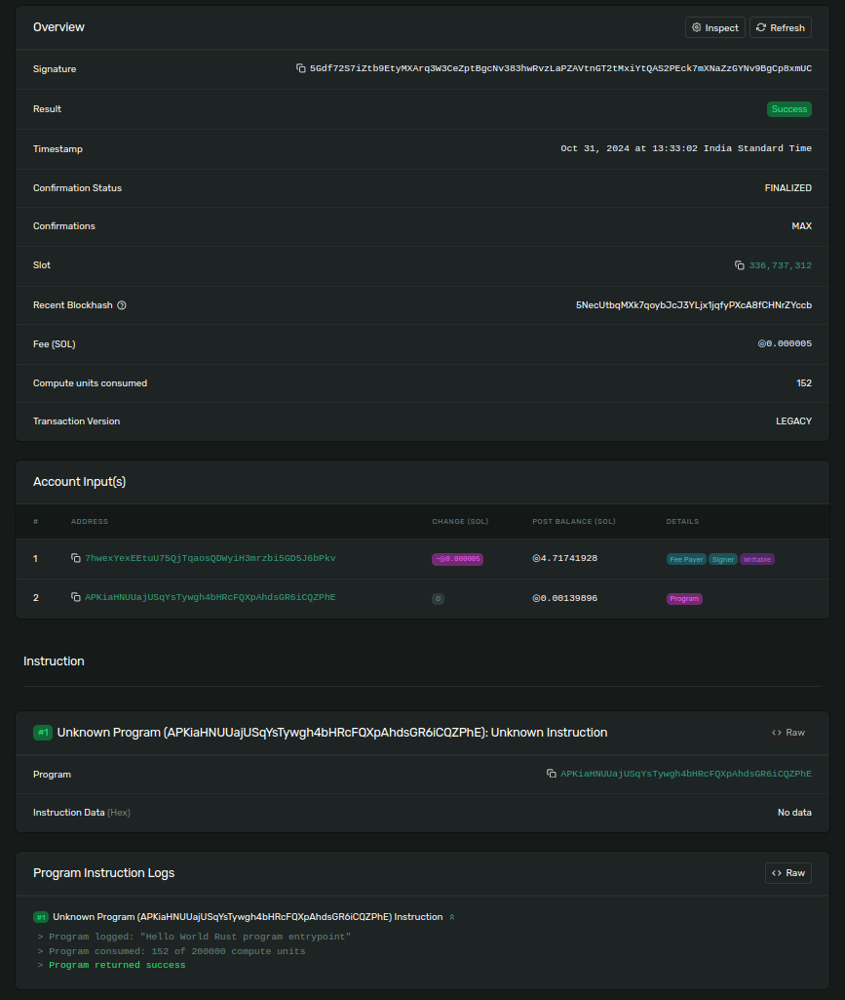
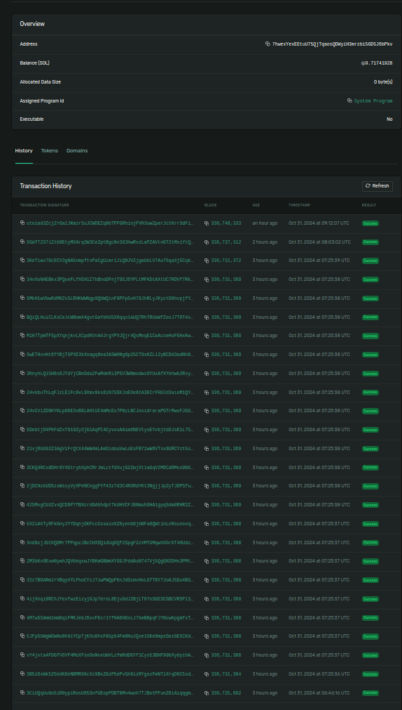

# Simplest Solana Program

- Just logs message
- Expects 0 accounts in input
- Expects 0 instructions in input

## Learnings
1. Input accounts - even though program expects zero accounts, on exploring the txn hash in solana explorer.

Account Inputs - two accounts are being passed to solana these are

i. Wallet which is signing the txn
ii. Program Id/Pub key

2. Program Deployment

- There are series of txns took place for the deployment of program, it is not a single step txn.

### Accounts Inputs

### Program Deployment Txns
